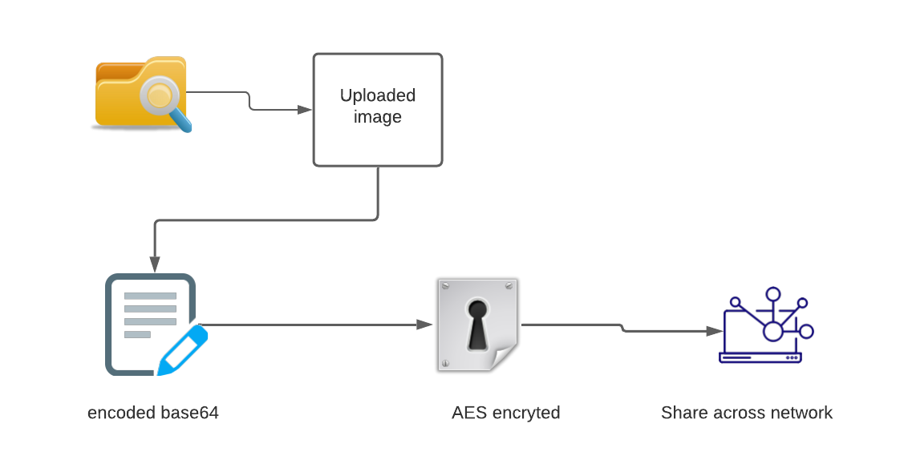
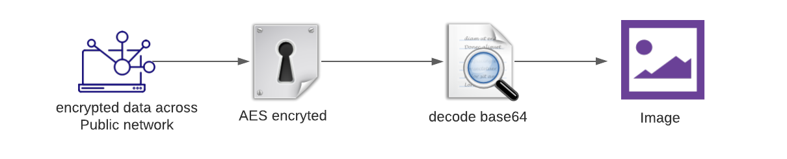
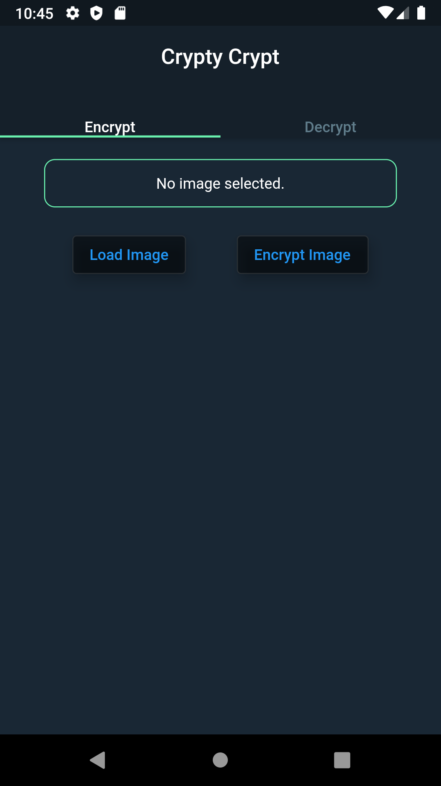
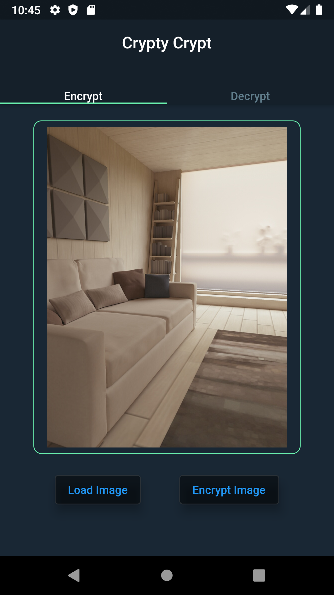
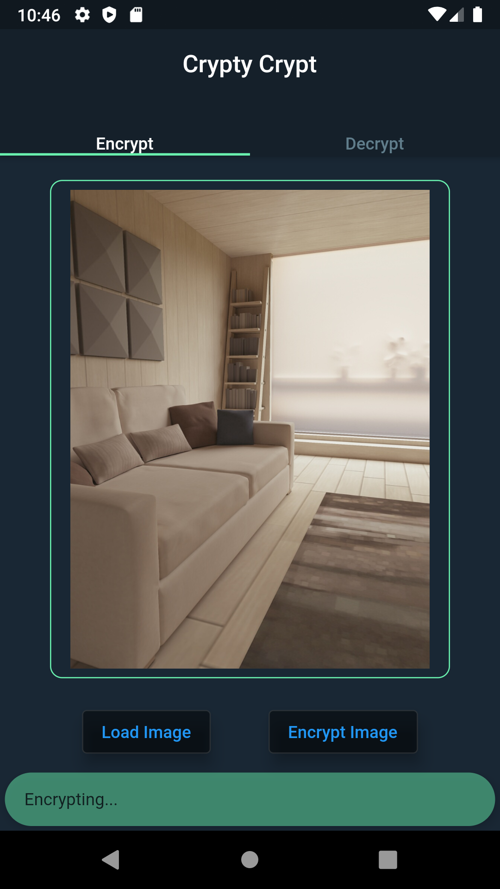
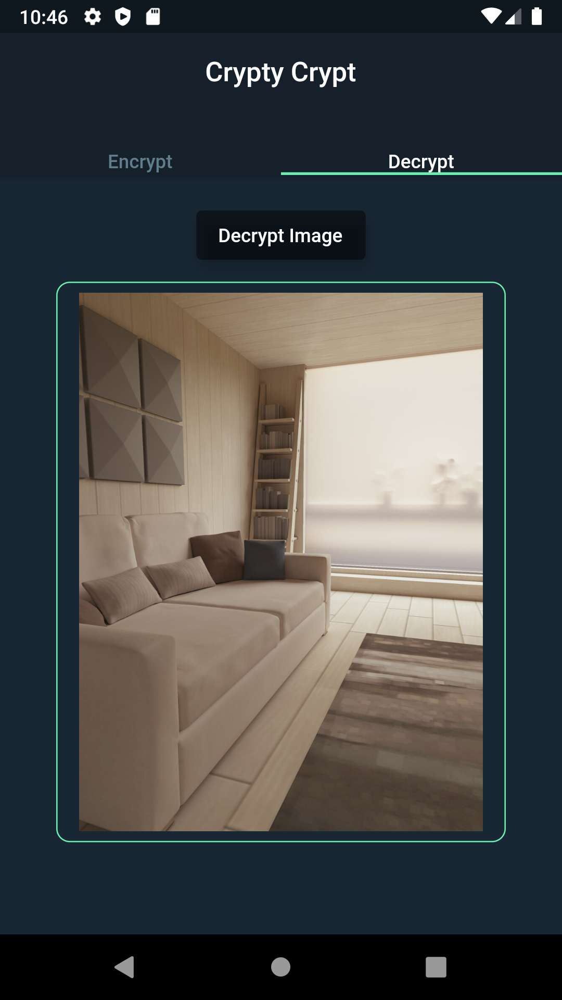

# **Crypty Crypt**

> Encrypt your image and share it to the world without any fear of spying your image by someone in the middle of the network.

## **How it works**

- Upload an image from your local storage.
- Encrypt it, using the application with its most advanced AES encryption algorithm.
- Go to decrypt screen and then decrypt your original image.

## **Process involved**

1. ### **Encryption**

    

2. ### **Decryption**

    

### **ScreenShots**

### **Upcoming Features**

- Share your encrypted image Unique ID with your friend so that he or she can use it for decryption with that ID.

#### *For more detailed explaination how this application works and what the Encryption algorithm used please fell free to explore [documentation](https://docs.google.com/document/d/1LcQ-f0P0VpFhGmUsMcyDEAMhOUOS8luSwR7OIXerPPw/edit#)*
